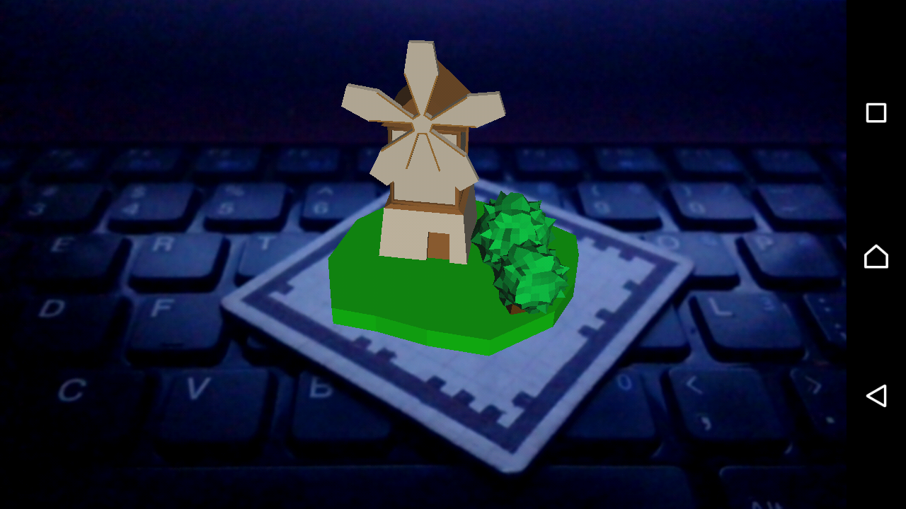

# Augmented Reality on Android

> It's an application for augmented reality on android.

## Credits

This application uses *Rajawali APIs*, I recommend to visit his github repository here: [https://github.com/Rajawali](https://github.com/Rajawali)

- **rajawali - rajawali** for 3D models renderer and AR,
- **rajawali - vuforia** for vuforia markers detection, 

